# RentFlow Architecture Diagrams

## System Overview

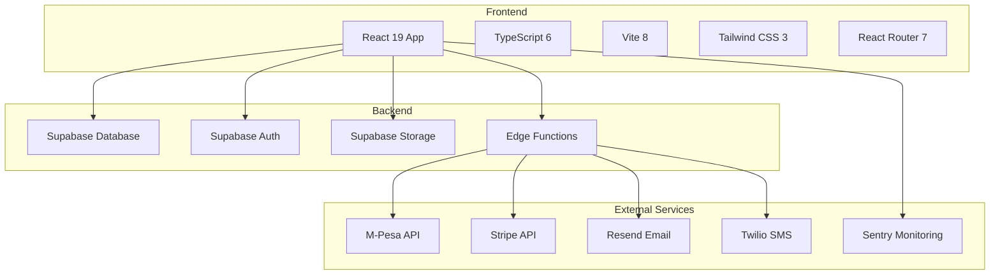

## Role-Based Access Control

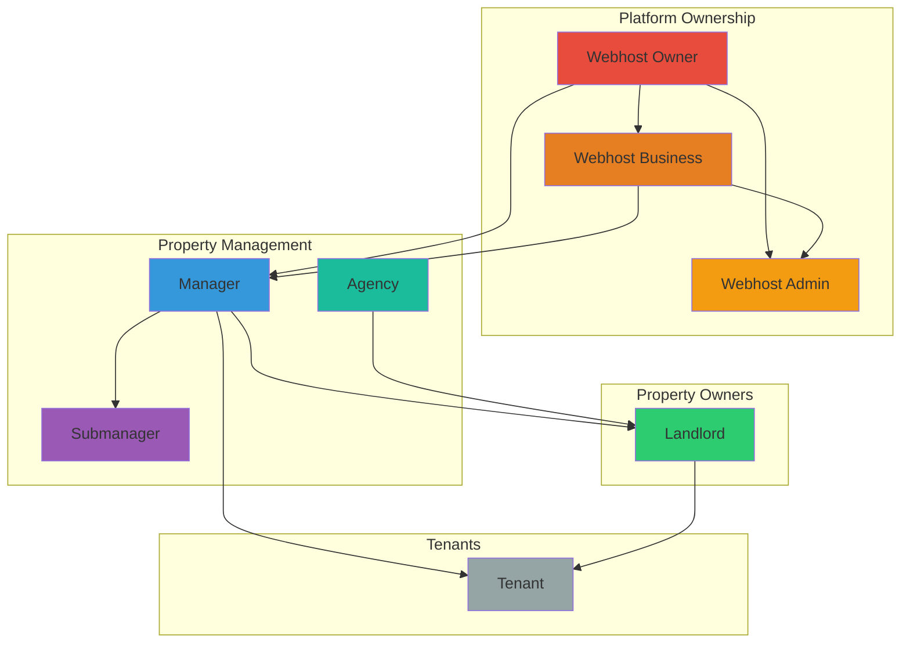

## Data Flow: Tenant Registration

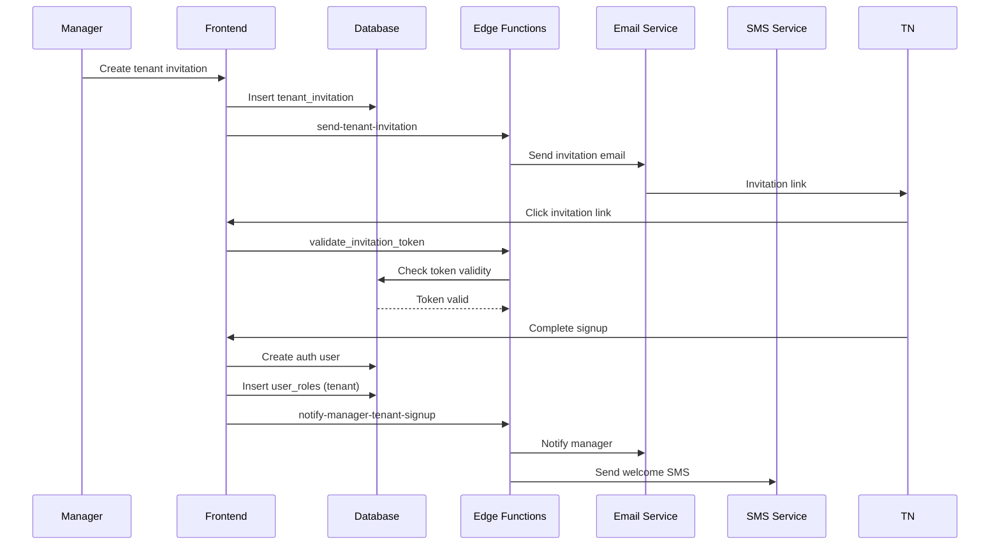

## Data Flow: Payment Processing

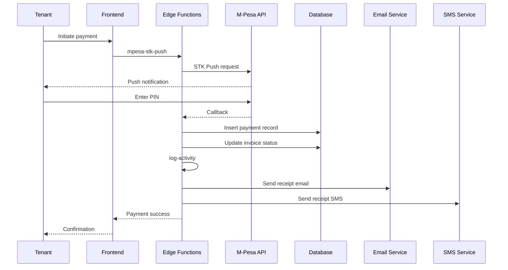

## Database Schema Relationships

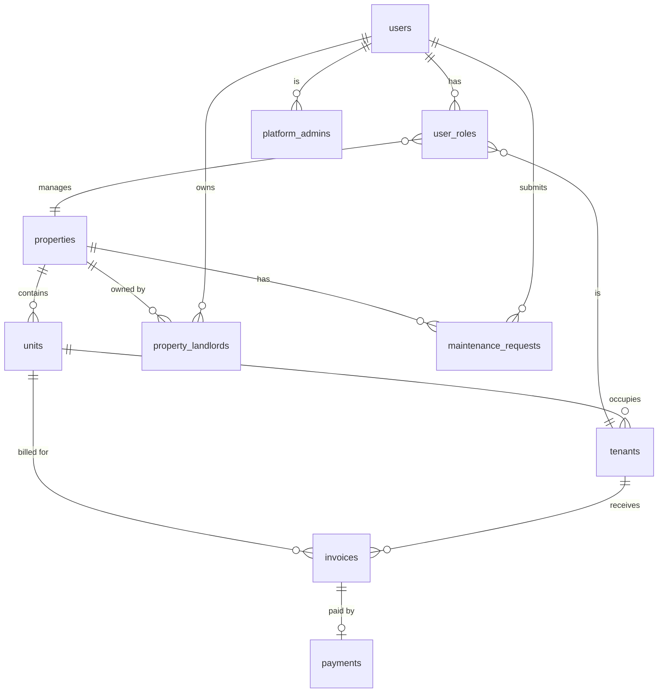

## Component Architecture

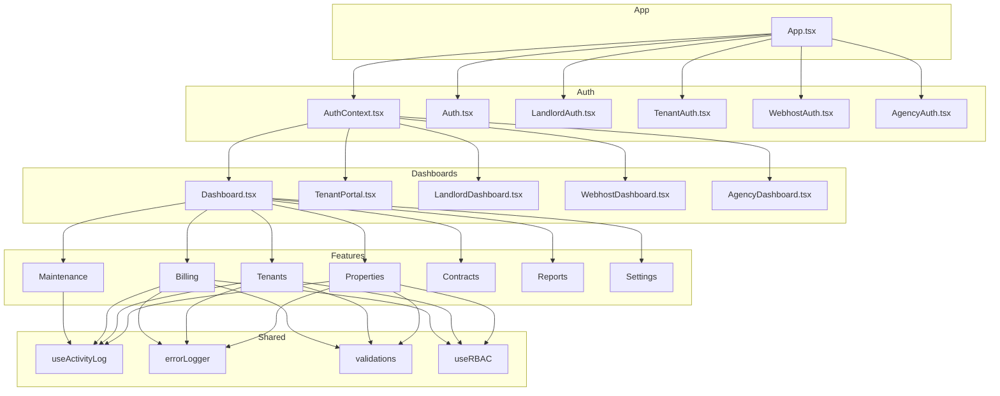

## Deployment Architecture

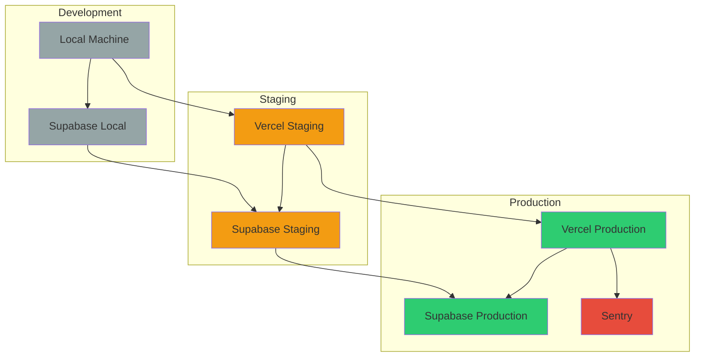

## Security Layers

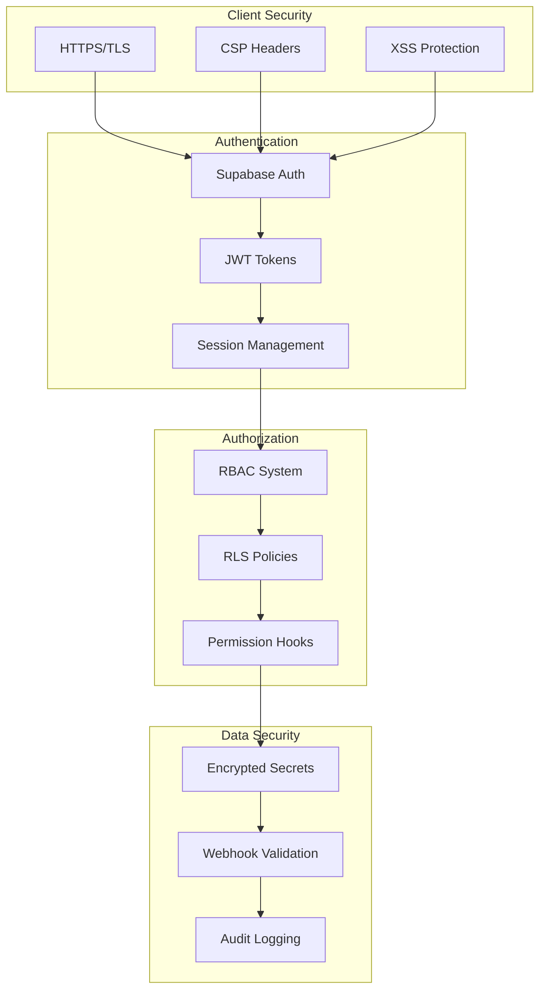

## Payment Flow Architecture

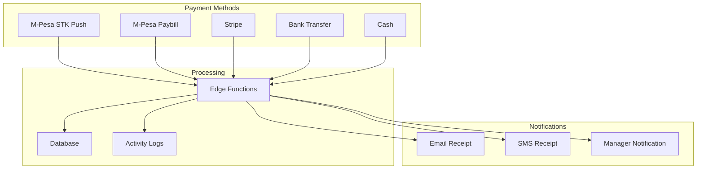

## Multi-Portal Architecture

```mermaid
graph TB
    subgraph "Portals"
        WA[/webhost]
        MA[/]
        AC[/agency]
        LD[/landlord/dashboard]
        TN[/portal]
    end
    
    subgraph "Authentication"
        AUTH[AuthContext]
        ROLE[Role Picker]
        PERM[Permission System]
    end
    
    subgraph "Shared Components"
        UI[UI Components]
        HOOKS[Custom Hooks]
        UTILS[Utilities]
    end
    
    WA --> AUTH
    MA --> AUTH
    AC --> AUTH
    LD --> AUTH
    TN --> AUTH
    AUTH --> ROLE
    ROLE --> PERM
    WA --> UI
    MA --> UI
    AC --> UI
    LD --> UI
    TN --> UI
    UI --> HOOKS
    HOOKS --> UTILS
```

## Real-time Data Flow

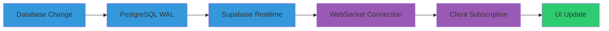

## Error Handling Flow

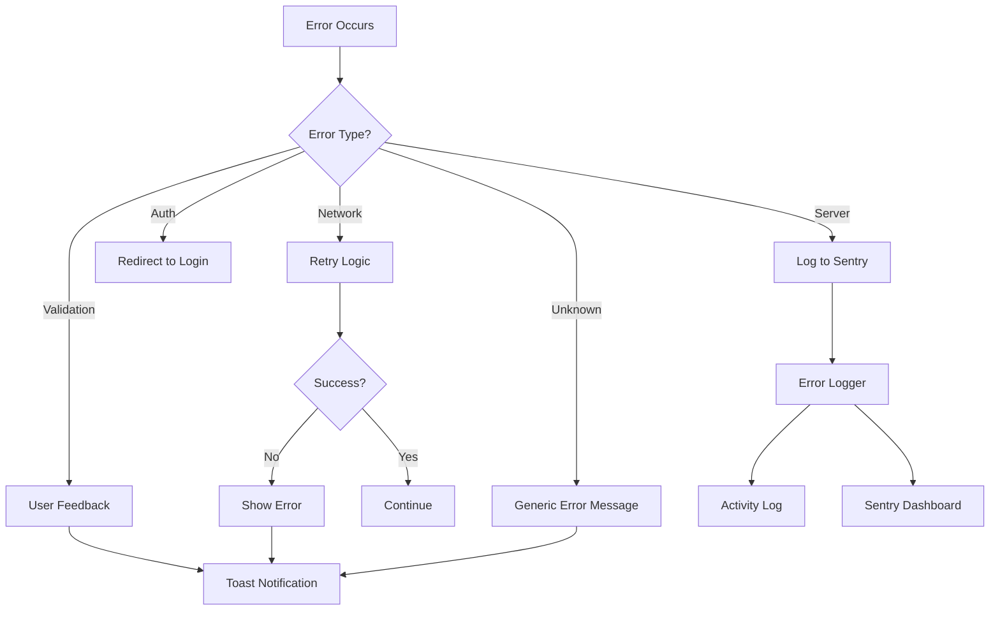

## State Management Architecture

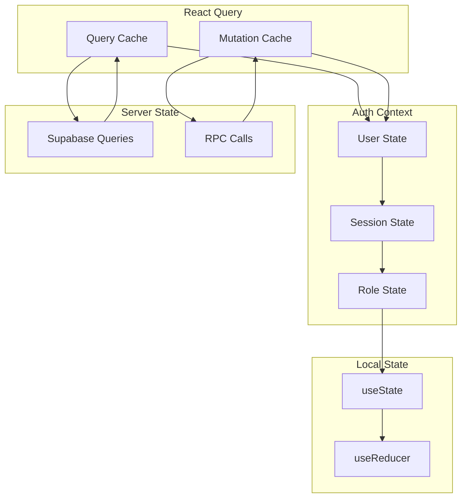

## File Upload Flow

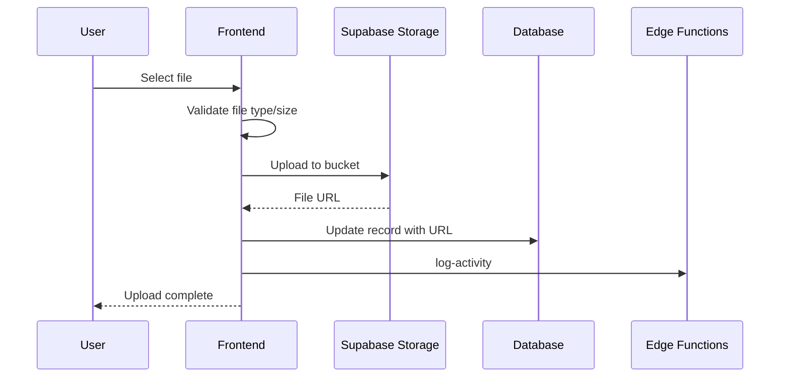

## Monitoring & Observability

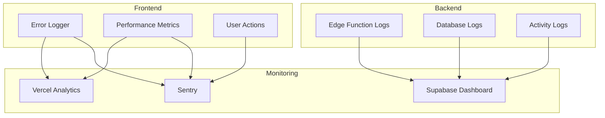

## Migration Strategy

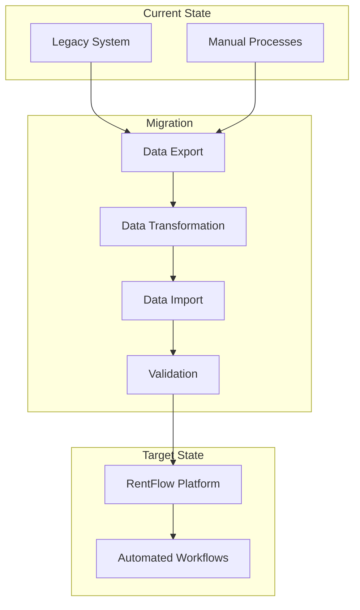

## Backup & Recovery

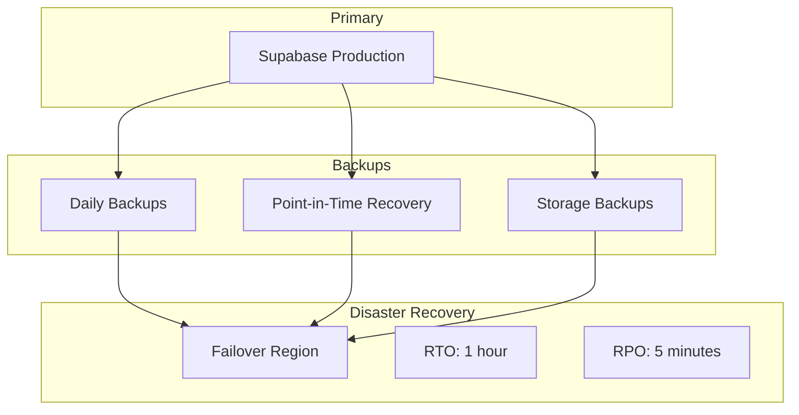

## API Rate Limiting

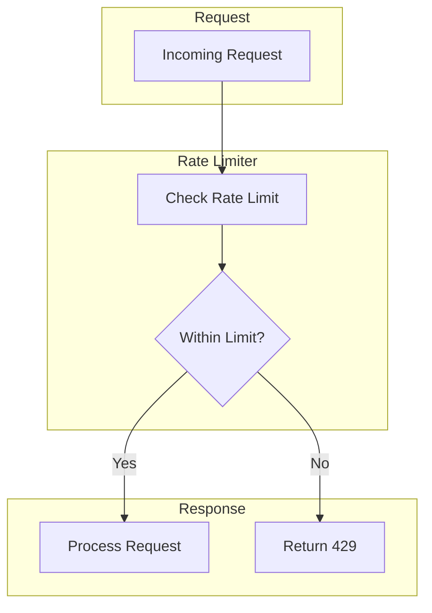

## Cache Strategy

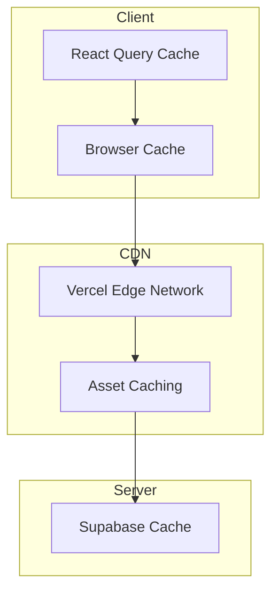

## Third-Party Integrations

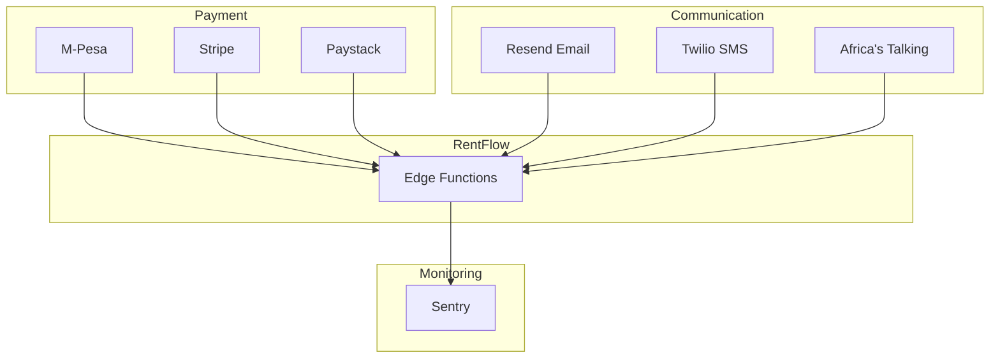
